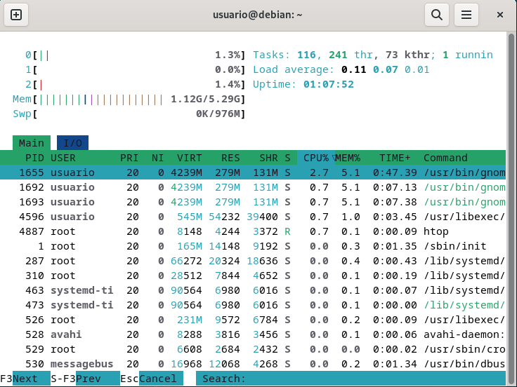

## MONITORIZACIÓN DE PROCESOS

En la administración de sistemas informáticos y redes, la monitorización
de procesos es una tarea fundamental para garantizar el rendimiento,
estabilidad y seguridad de los servidores. Linux ofrece varias
herramientas en línea de comandos para monitorizar el hardware: CPU,
memoria, uso de disco duro y red.

# 1. Comando ps
   
El comando ps proporciona una instantánea de los procesos en
ejecución. Es útil para obtener información específica sobre
procesos.

Sintaxis básica:

ps [opciones]
Opciones comunes:

● ps sin opciones:

● ps a:

● ps aux:

● ps -C nano <nombre>: 

# 2. Comando top

El comando top permite monitorizar el sistema en tiempo real y
detectar procesos que consumen muchos recursos,
proporcionando una vista dinámica y en tiempo real de los
procesos en ejecución y el uso de recursos del sistema (CPU,
memoria y procesos en ejecución).
Sintaxis básica:

top [opciones]
Opciones comunes:

● top T:

● top M:

● top P:

!

● top p:

● top R:

● top U:

● top q:

● top k:

# 3. Comando htop

htop es una versión mejorada y más amigable de top, con una
interfaz interactiva y funcionalidad adicional.

Sintaxis básica:
htop [opciones]
Opciones:

● htop -u <usuario>:

● htop --tree:

● htop -p <PID1,PID2>:

Atajos de Teclado:

● F2 (Setup) - Configuración

● F3 (Search) - Búsqueda

● F4 (Filter) - Filtro

● F5 (Tree) - Vista en árbol

● F6 (Sort) - Ordenar

● F9 (Kill) - Terminar un Proceso

# 4. Comando atop

atop es una herramienta avanzada para monitorizar no solo
procesos, sino también otros recursos del sistema, como disco, red
y memoria.

Uso básico:
● Ejecutar en tiempo real:

atop

● Consultar registros guardados:

atop -r archivo_de_registratop

